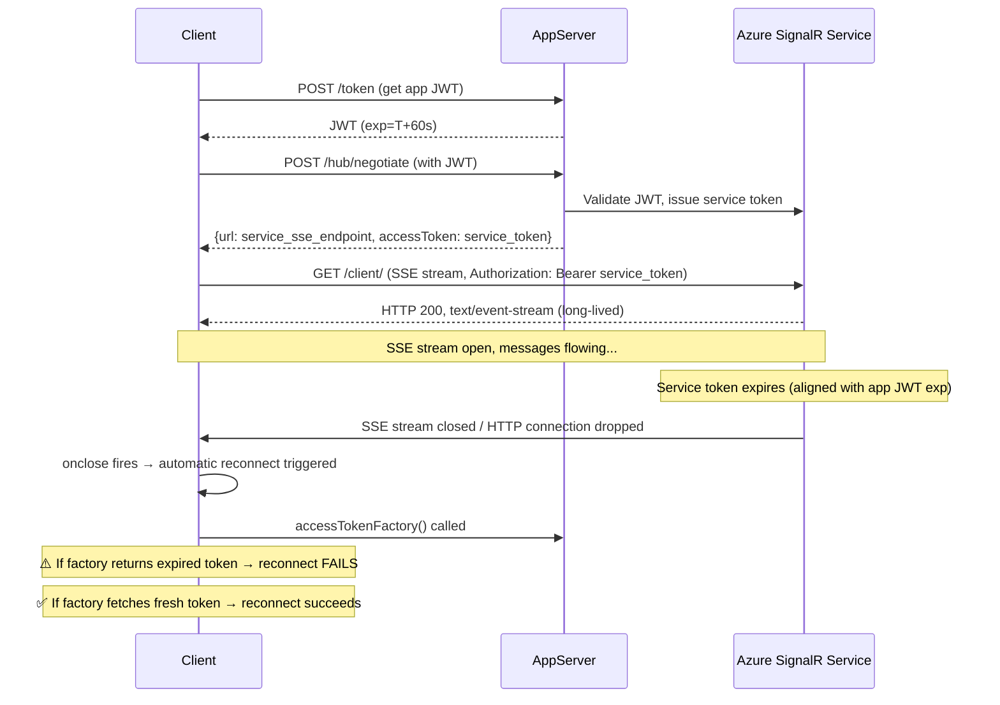

# SSE Connection: Access Token Expiry Simulation

## What Happens When the Access Token Expires on an SSE Connection

### Connection Flow (SSE + Azure SignalR Service)



### Key Behaviors

| Phase | What Happens |
|-------|-------------|
| **Negotiate** | App server validates the app JWT, then Azure SignalR SDK issues a *service access token* whose lifetime is controlled by `AccessTokenLifetime` (default 1 hour, configurable). |
| **SSE stream open** | Client holds a long-lived HTTP response (`text/event-stream`). The service token was validated at connection time. |
| **Token expires** | Azure SignalR Service's heartbeat detects the service token has expired → it aborts the SSE HTTP response → client receives an end-of-stream or network error. |
| **Reconnect attempt** | SignalR client (with `withAutomaticReconnect()`) calls `accessTokenFactory()` to get a token, then re-negotiates. |
| **Static token (bug)** | If `accessTokenFactory` returns the same expired token, negotiate fails with HTTP 401 → reconnect fails → connection permanently closed. |
| **Dynamic token (correct)** | If `accessTokenFactory` fetches a new token from `/token`, negotiate succeeds → new SSE stream established. |

### Difference from WebSocket

- **WebSocket**: Once upgraded, the connection stays open regardless of token expiry *at the app-server level*. However, Azure SignalR Service still enforces its service token expiry and will close the WebSocket frame.
- **SSE**: The HTTP response is terminated when the service token expires. Additionally, each client-to-server message is a separate HTTP POST that carries the token in headers — so expired tokens also block *sending*.
- **Long-Polling**: Each poll is a fresh HTTP request with the token. Expiry is noticed immediately on the next poll.

### Timeline of Events (60-second token)

```
T+0s   : Client connects, SSE stream established
T+0-60s: Messages flow normally
T+60s  : Service token expires
T+60s  : Azure SignalR closes the SSE stream
T+60s  : Client fires onclose/onreconnecting
T+60s  : Client calls accessTokenFactory()
T+60s  : Client POSTs /hub/negotiate with new token
T+61s  : New SSE stream established (if token is fresh)
```
